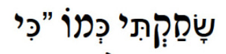
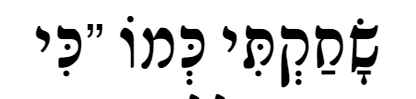

# Changelog

All notable changes to this project will be documented in this file.

The format is based on [Keep a Changelog](https://keepachangelog.com/en/1.0.0/), and this project adheres
to [Semantic Versioning](https://semver.org/spec/v2.0.0.html).

## [0.8.1] - 2023-12-11

### Fixed

- Corrected an issue with subclasses of `BaseHebrewChar` where use of `__eq__` would break when the type for the 
  comparison was not the same as itself.

## [0.8.0] - 2023-12-10

### Added

- Added `Hebrew.normalize`, a function for normalizing the hebrew characters in a string. This is typically needed with 
text includes special hebrew characters.

  Hidden among hebrew text can be special characters that are visually identical humans, but are made up of different 
  unicode characters. However, this can cause issues with presentation when there is no support for these characters.

  

  In this case, the first letter is made up of 2 unicode characters, [sin with a dot](https://en.wiktionary.org/wiki/%D7%A9%D7%82)
  and [qamatz](https://en.wiktionary.org/wiki/%D6%B8). The issue here is the sin. By normalizing the sin with a dot to 2 unicode 
  characters, [ש](https://en.wiktionary.org/wiki/%D7%A9) and the [dot](https://en.wiktionary.org/wiki/%D7%82), the display 
  will look right!

  

  To normalize content, use the `Hebrew.normalize` function:
  ```python
  from hebrew import Hebrew

  hs = Hebrew('שָׂחַקְתִּי כְּמוֹ')

  assert len(hs.string) == 14
  assert len(hs.normalize().string) == 18
  ```

  ### Normalizing Yiddish
  
  By default, special yiddish characters such as [ײ](https://en.wiktionary.org/wiki/%D7%B2) (double Yod) are _not_ normalized.
  However, [ײַ](https://en.wiktionary.org/wiki/%EF%AC%9F) (double Yod with a Patah) will be converted to [ײַ](https://en.wiktionary.org/wiki/%D7%B2%D6%B7).
  
  To fully "normalize" yiddish characters, pass `True` to `normalize`.


## [0.7.0] - 2023-12-10

### Added

- New function `Hebrew.from_number` converts an int into its hebrew form

### Example:

``` python
from hebrew import Hebrew

hs1 = Hebrew.from_number(2)
print(hs1)  # ב׳

# Do not add punctuation
hs2 = Hebrew.from_number(2, geresh=False)
print(hs2)  # ב
```

## [0.6.2] - 2023-12-08

### Changed

- Added 3.12 as a supported version
- Updated project dependencies.

### Removed
- Removed 3.11 as a supported version

## [0.6.1] - 2022-10-28

### Changed

- Added 3.11 as a supported version

## [0.6.0] - 2022-04-19

### Added

- Added the remaining missing Gematria methods. The complete list of supported methods is: 
  - `ACHAS_BETA`
  - `ALBAM`
  - `ATBASH`
  - `AVGAD`
  - `AYAK_BACHAR`
  - `MISPAR_BONEEH`
  - `MISPAR_GADOL`
  - `MISPAR_HAACHOR`
  - `MISPAR_HAMERUBAH_HAKLALI`
  - `MISPAR_HECHRACHI`
  - `MISPAR_KATAN`
  - `MISPAR_KATAN_MISPARI`
  - `MISPAR_KIDMI`
  - `MISPAR_KOLEL`
  - `MISPAR_MESHULASH`
  - `MISPAR_MISPARI`
  - `MISPAR_MUSAFI`
  - `MISPAR_NEELAM`
  - `MISPAR_PERATI`
  - `MISPAR_SHEMI_MILUI`
  - `MISPAR_SIDURI`
  - `OFANIM`
  - `REVERSE_AVGAD`
  
  ### Example:
  ```python
  from hebrew import Hebrew
  from hebrew import GematriaTypes
  
  hs = Hebrew('בְּרֵאשִׁ֖ית בָּרָ֣א אֱלֹהִ֑ים אֵ֥ת הַשָּׁמַ֖יִם וְאֵ֥ת הָאָֽרֶץ׃')
  
  print(hs.gematria())  # 2701
  print(hs.gematria(GematriaTypes.MISPAR_GADOL))  # 4631
  ```

## [0.5.8] - 2022-04-18

### Added

- Added Gematria methods `MISPAR_MUSAFI`. This is the first of the complex Gematria types that goes deeper than just 
adding up values assigned to each letter, necessitating internal changes to the `Hebrew` class.

## [0.5.7] - 2022-04-18

### Added

- Added Gematria methods `MISPAR_KATAN`, `MISPAR_PERATI`, `ATBASH`, `ALBAM`, `MISPAR_MESHULASH`.

## [0.5.6] - 2022-04-18

### Added

- Added a new gematria method, `MISPAR_SIDURI`.

## [0.5.5] - 2021-11-22

### Added

- Added a new gematria method, `MISPAR_GADOL`. A contribution by [Taber Andrew Bain](https://github.com/taber)

## [0.5.4] - 2021-11-21

### Fixed

- Fixed an issue where `Hebrew.gematria` would through an error if the input string had no hebrew characters.
  In this case, we now return a value of 0.

## [0.5.3] - 2021-11-15

### Changed

- Split the `PunctuationChar` type chars into `TaamimChar` and `OtherChar` types in `hebrew.char`.
- Renamed the `no_punctuation` method of `Hebrew` to `no_taamim`.

## [0.5.0] - 2021-11-14

### Added

- Added the method `Hebrew.gematria` method for calculating the gematria of a string.
- Added `mispar_hechrachi` as a supported gematria type.

``` python
>>> from hebrew import Hebrew
>>> from hebrew.gematria import GematriaTypes

>>> Hebrew("בְּרֵאשִׁ֖ית בָּרָ֣א אֱלֹהִ֑ים אֵ֥ת הַשָּׁמַ֖יִם וְאֵ֥ת הָאָרֶץ׃").gematria(GematriaTypes.MISPAR_HECHRACHI)
2701
```

## [0.4.0] - 2021-11-14

### Added

- Added `hebrew.chars` with constants for Hebrew characters and classes to represent each letter.
- Moved constants out of `Hebrew` and into `hebrew.chars`.
- Constant values, previously strings, are now instances of a class with metadata for each letter.

### Removed

- Support for Python 3.6 was removed because we are now using `@dataclasse`. It is possible to make this work with
  3.6 but I am choosing not to at this time. If this is a problem for you, feel free to open an issue.

## [0.3.0] - 2021-11-08

### Changed

- Renamed the python package from `hebrewstring` to `hebrew`.

## [0.2.0] - 2021-11-07

### Added

- Added the `__eq__` method to the `GraphemeString` object.

  This is to support the `==` operator when comparing two `GraphemeString` objects.

- Added the `__add__` method to the `GraphemeString` object.

  This is to support the `+` operator when adding two `GraphemeString` objects together.

- Added the `__hash__` method to the `GraphemeString` object.

  This is to support the `hash()` function for a `GraphemeString` instance and allows it (as an example) to be used as
  a `dict` key.

## [0.1.2] - 2021-11-07

### Added

- Added base code, tests, and examples for the first release.