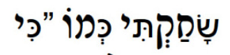

<h1 align="center" style="font-family:'Courier New'">Hebrew("בְּרֵאשִׁ֖ית")</h1>
<p align="center">
    <em>A python package with methods to handle the complexities of Hebrew text, calculate Gematria, and more.</em>
</p>
<p align="center">
<a href="https://pypi.org/project/hebrew/" target="_blank">
    
</a>
<a href="https://badge.fury.io/py/hebrew">
    
</a>
<a href="https://github.com/avi-perl/hebrew/actions/workflows/test.yml" target="_blank">
    
</a>
<a href="https://codecov.io/gh/avi-perl/hebrew" target="_blank">
  
</a>
󠀠󠀠
<a href="https://twitter.com/__aviperl__" target="_blank">
    
</a>
</p>

---

**Documentation**: [https://hebrew.aviperl.me/](https://hebrew.aviperl.me/)

**Repository**: [https://github.com/avi-perl/hebrew](https://github.com/avi-perl/hebrew)

---

# Installation

<!--pytest.mark.skip-->

```bash
$ pip install hebrew
```

# Example

`Hebrew` assists in working with Hebrew text by providing methods to handle the text according to user-perceived
characteristics. Additionally, methods for common Hebrew text processing are provided.

```python
from hebrew import Hebrew
from hebrew.chars import HebrewChar, ALEPH

hs = Hebrew('בְּרֵאשִׁ֖ית')
print(list(hs.graphemes))  # ['בְּ', 'רֵ', 'א', 'שִׁ֖', 'י', 'ת']
print(hs.text_only())  # בראשית

print(ALEPH)  # HebrewChar(char='א', name='Aleph', hebrew_name='אָלֶף', name_alts=['Alef'], hebrew_name_alts=None, final_letter=False)

print(HebrewChar.search('bet'))  # HebrewChar(char='בּ', name='Bet', hebrew_name='בֵּית', name_alts=None, hebrew_name_alts=None, final_letter=False)
```

## Gematria

The `Hebrew` class includes a `gematria` function that can return a value for _23_ different variations of Gematria!

```python
from hebrew import Hebrew
from hebrew import GematriaTypes

hs = Hebrew(':מוֹדֶה אֲנִי לְפָנֶֽיךָ מֶֽלֶךְ חַי וְקַיָּם שֶׁהֶחֱזַֽרְתָּ בִּי נִשְׁמָתִי בְּחֶמְלָה, רַבָּה אֱמוּנָתֶֽךָ')

assert hs.gematria() == 3111
assert hs.gematria(GematriaTypes.MISPAR_GADOL) == 5111
```

Messy inputs, such as strings with english text mixed in, is supported. However, do be careful to work with sanitized
strings as much as possible.

```python
from hebrew import Hebrew

hs1 = Hebrew(
    '''
    Text:          ":מוֹדֶה אֲנִי לְפָנֶֽיךָ מֶֽלֶךְ חַי וְקַיָּם שֶׁהֶחֱזַֽרְתָּ בִּי נִשְׁמָתִי בְּחֶמְלָה, רַבָּה אֱמוּנָתֶֽךָ"
    Translation:   "I give thanks to You living and everlasting King for You have restored my soul with mercy. Great is Your faithfulness."
    '''
)
hs2 = Hebrew(':מוֹדֶה אֲנִי לְפָנֶֽיךָ מֶֽלֶךְ חַי וְקַיָּם שֶׁהֶחֱזַֽרְתָּ בִּי נִשְׁמָתִי בְּחֶמְלָה, רַבָּה אֱמוּנָתֶֽךָ')

assert hs1.gematria() ==  hs2.gematria()  # 2701
```

Major kudos goes to [TorahCalc](https://www.torahcalc.com/gematria/) whose calculator and explanations were critical to
the development of this feature.

## Numerical Conversions

You can create a Hebrew object that represents a number using the `from_number` method. This is handy for displaying numbers in Hebrew form.

```python
from hebrew import Hebrew

hs1 = Hebrew.from_number(2)
assert hs1 == 'ב׳'

# Add an apostrophe instead of the unicode geresh
hs2 = Hebrew.from_number(2, geresh=False)
assert hs2 ==  "'ב"

# Do not add punctuation
hs2 = Hebrew.from_number(2, punctuate=False)
assert hs2 == 'ב'
```

## Character Normalization
Hidden among hebrew text can be special characters that are visually identical humans, but are made up of different 
unicode characters. However, this can cause issues with presentation when there is no support for these characters.



In this case, the first letter is made up of 2 unicode characters, [sin with a dot](https://en.wiktionary.org/wiki/%D7%A9%D7%82)
and [qamatz](https://en.wiktionary.org/wiki/%D6%B8). The issue here is the sin. By normalizing the sin with a dot to 2 unicode 
characters, [ש](https://en.wiktionary.org/wiki/%D7%A9) and the [dot](https://en.wiktionary.org/wiki/%D7%82), the display 
will look right!


To normalize content, use the `Hebrew.normalize` function:
```python
from hebrew import Hebrew

hs = Hebrew('שָׂחַקְתִּי כְּמוֹ')

assert len(hs.string) == 14
assert len(hs.normalize().string) == 18
```

### Normalizing Yiddish

By default, special yiddish characters such as [ײ](https://en.wiktionary.org/wiki/%D7%B2) (double Yod) are _not_ normalized.
However, [ײַ](https://en.wiktionary.org/wiki/%EF%AC%9F) (double Yod with a Patah) will be converted to [ײַ](https://en.wiktionary.org/wiki/%D7%B2%D6%B7).

To fully "normalize" yiddish characters, pass `True` to `normalize`.


## Grapheme Characters

Hebrew text comes in different forms, depending on the context. Hebrew text may appear with Niqqudot
"a system of diacritical signs used to represent vowels or distinguish between alternative pronunciations of letters
of the Hebrew alphabet". [^1] Additionally, Hebrew text may appear with extensive punctuation characters that connect
words, separate them, and cantillation marks "used as a guide for chanting the text, either from the printed text or,
in the case of the public reading of the Torah" [^2].

Because of the above, from the perspective of a hebrew reader, the following 3 words are the same:

1. **בְּרֵאשִׁ֖ית**
2. **בְּרֵאשִׁית**
3. **בראשית**

However, as a unicode string, they are entirely different because of the additional characters.

```python
assert len("בְּרֵאשִׁ֖ית") == 12
assert len("בְּרֵאשִׁית") == 11
assert len("בראשית") == 6
```

This impacts the user is a number of other ways. For example, if I want to get the root of this hebrew word using a slice:
_Expected: `רֵאשִׁ֖ית`_

```python
he = "בְּרֵאשִׁ֖ית"
assert he[-5:] == 'ִׁ֖ית'
```

The solution to this is to handle the unicode string as a list of grapheme[^3] characters, where each letter and its
accompanying characters are treated as a single unit.

### Working with Grapheme Characters

Using the [grapheme](https://github.com/alvinlindstam/grapheme) library for python, we can work with the grapheme
characters as units. This allows us to get the right number of characters, slice the string correctly, and more.

```python
import grapheme

assert grapheme.length("בְּרֵאשִׁ֖ית") == 6
assert grapheme.slice("בְּרֵאשִׁ֖ית", start=1, end=6) == 'רֵאשִׁ֖ית'
```

This library includes 2 classes. `GraphemeString` is a class that supports all the functions made available by `grapheme`.
The 2nd class `Hebrew` subclasses `GraphemeString` and adds methods for handling Hebrew text. This allows us to
interact with the text like so:

```python
from hebrew import Hebrew

v2 = Hebrew('מוֹדֶה אֲנִי לְפָנֶֽיךָ')
assert v2.no_taamim() == 'מודה אני לפנֽיך'
assert v2.text_only() == 'מודה אני לפניך'

assert v2.length == 14_44
print(v2.words())  # [מוֹדֶה, אֲנִי, לְפָנֶֽיךָ]
```

The text in these examples and used in testing were sourced from [Sefaria](https://github.com/Sefaria/Sefaria-Export).

## `hebrew.chars` and Character Constants

`hebrew.Chars` contains constants for every letter as well as lists by character category's.
Each value is an instance of a class that represents a character in the Hebrew character set with relevant properties.
Since this library seeks to support the use of the Hebrew language in the way it is used, characters such as "בּ" can be
located (`BET`) even though, strictly speaking, "בּ" is not part of the hebrew alphabet; it is a Hebrew letter plus a dot.

```python
from hebrew.chars import FINAL_LETTERS, YIDDISH_CHARS, TSADI

print(TSADI)  # HebrewChar(char='צ', name='Tsadi', hebrew_name='צַדִי', name_alts=['Tzadik'], hebrew_name_alts=['צדיק'], final_letter=False)

assert {c.name: c.char for c in FINAL_LETTERS} == {'Chaf Sofit': 'ך', 'Mem Sofit': 'ם', 'Nun Sofit': 'ן', 'Fe Sofit': 'ף', 'Tsadi Sofit': 'ץ'}

assert [c.char for c in YIDDISH_CHARS] == ['ײ', 'װ', 'ױ']
```

A letter can be retrieved using the `CHARS` dict; A dict of all instances of all supported Char types where the key is
the char and the value is an instance of BaseHebrewChar.

```python
from hebrew.chars import CHARS

print(CHARS.get('בּ'))  # HebrewChar(char='בּ', name='Bet', hebrew_name='בֵּית', name_alts=None, hebrew_name_alts=None, final_letter=False)
```

Search is also supported so that letters can be retrieved by their name.

```python
from hebrew.chars import HebrewChar

print(HebrewChar.search('bet'))  # HebrewChar(char='בּ', name='Bet', hebrew_name='בֵּית', name_alts=None, hebrew_name_alts=None, final_letter=False)
```

## Contributing

Contributions in the form of pull requests are very welcome! I'm sure many more helpful methods related to hebrew text
could be helpful. More information and instructions for contributing can be found [here](CONTRIBUTING).

[^1]: [https://en.wikipedia.org/wiki/Niqqud](https://en.wikipedia.org/wiki/Niqqud)
[^2]: [https://en.wikipedia.org/wiki/Hebrew_cantillation](https://en.wikipedia.org/wiki/Hebrew_cantillation)
[^3]: [https://en.wikipedia.org/wiki/Grapheme](https://en.wikipedia.org/wiki/Grapheme)
